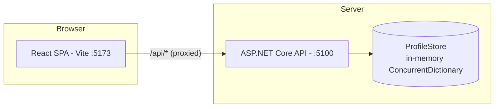
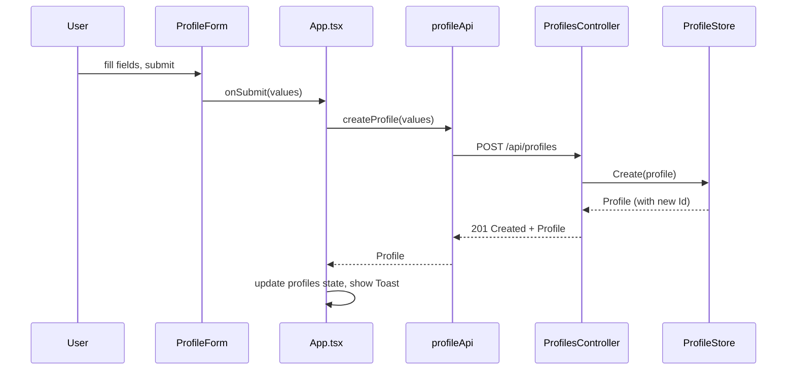

# Software Design Specification — TalayProject

## 1. Overview

TalayProject is a full-stack user profile management application:

- **Backend**: ASP.NET Core (net10.0) Web API — `backend/UserProfile.Api`
- **Frontend**: React 19 + TypeScript + Vite single-page app — `frontend/`

The frontend is a dashboard for listing, searching, creating, editing, and deleting user profiles, backed by an in-memory REST API.

## 2. Architecture



- In development, Vite proxies requests from `/api/*` on port 5173 to `http://localhost:5100` (see `frontend/vite.config.ts`). The frontend never calls absolute backend URLs.
- CORS on the API allows origin `http://localhost:5173` (see `Program.cs`).
- Data is **not persisted**: `ProfileStore` is an in-memory `ConcurrentDictionary<Guid, Profile>` seeded with one sample profile at startup; state resets on API restart.

## 3. Backend Design

Current layout is a layered (technical) architecture (legacy — new features should use Vertical Slice folders per `.github/copilot-instructions.md`):

```
Controllers/ProfilesController.cs   # HTTP endpoints (api/profiles)
Models/Profile.cs                   # domain entity
Models/ProfileRequest.cs            # create/update DTO with validation attributes
Services/ProfileStore.cs            # in-memory singleton data store
```

- `ProfilesController` is a thin controller: maps requests to `ProfileRequest` → `Profile`, delegates CRUD to `ProfileStore`, and returns standard HTTP results (`Ok`, `CreatedAtAction`, `NoContent`, `NotFound`).
- `ProfileStore` is registered as a singleton (`AddSingleton<ProfileStore>`), so all requests share one instance for the lifetime of the process.
- Validation is declarative via `DataAnnotations` on `ProfileRequest` (`Required`, `StringLength`, `EmailAddress`, `Phone`, `Url`); ASP.NET Core model binding automatically returns `400 Bad Request` on failure.
- OpenAPI (`AddOpenApi`/`MapOpenApi`) is enabled in the Development environment.

See [API-Spec.md](API-Spec.md) for the full endpoint contract.

## 4. Frontend Design

Atomic-Design-oriented structure (migration in progress — see `.github/copilot-instructions.md`):

```
src/
  api/profileApi.ts      # fetch wrapper for /api/profiles
  types.ts                # Profile, ProfileFormValues types
  App.tsx                 # top-level state/orchestration (page-level)
  components/             # not yet split into atoms/molecules/organisms/templates
```

Key responsibilities of `App.tsx` (acts as the page/container):

- Owns all state: `profiles`, `loading`, `editingId`, `submitting`, `error`, `query` (search filter), `deleteTarget`/`deleteBusy` (delete confirmation), `toast` (success/error notifications).
- Fetches profiles from `profileApi` on mount and after mutations.
- Client-side filtering via `matchesQuery` (matches `fullName`, `email`, `phoneNumber`, case-insensitive substring).
- Delegates rendering to composed components: `Sidebar`, `Topbar`, `ProfileCard`, `ProfileForm`, `RecentProfiles`, `StatCard`, `ConfirmDialog`, `Toast`, `ErrorBanner`, `LoadingSkeleton` variants.

### Data flow (create example)



## 5. Data Model

| Field         | Type    | Constraints                       |
|---------------|---------|------------------------------------|
| `id`          | guid    | server-generated, immutable        |
| `fullName`    | string  | required, max 100 chars            |
| `email`       | string  | required, valid email address      |
| `phoneNumber` | string? | optional, valid phone format       |
| `bio`         | string? | optional, max 500 chars            |
| `avatarUrl`   | string? | optional, valid URL                |

## 6. Cross-Cutting Concerns

- **Styling**: dark-only dashboard theme; CSS custom properties in `frontend/src/index.css` (`--page-bg`, `--accent`, `--danger`, etc.). Each component has a colocated `ComponentName.css`.
- **Error handling**: `ErrorBanner` surfaces API failures; `Toast` surfaces transient success/error feedback.
- **Persistence**: none — restarting the API process clears all profiles except the seeded sample.
- **Testing**: no automated test project exists yet for either frontend or backend.

## 7. Build & Run

- Backend: `dotnet build UserProfile.slnx` (repo root); runs on port 5100.
- Frontend: `npm run dev` (port 5173); `npm run lint` (oxlint); `npm run build` (`tsc -b && vite build`).

## 8. Known Limitations / Future Work

- No persistent storage (data lost on restart) — would need a real datastore (e.g., EF Core + SQL/SQLite) behind `ProfileStore`'s interface.
- No authentication/authorization on the API.
- Frontend components not yet fully migrated to the atoms/molecules/organisms/templates/pages tiers described in `.github/copilot-instructions.md`.
- Backend not yet migrated to Vertical Slice Architecture; new features should use `Features/<FeatureName>/<Slice>` folders per the same instructions.
