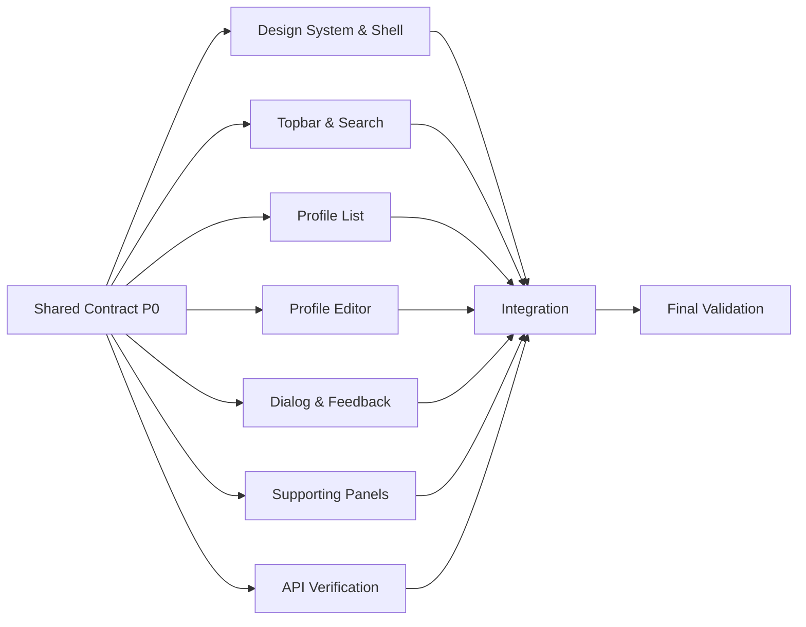

# User Profiles UI Improvement Specification

## เป้าหมาย

ปรับหน้า User Profiles ให้มีรูปแบบใกล้เคียงภาพอ้างอิง: dashboard โทนมืดที่ดูเป็นระบบ มี sidebar, toolbar, พื้นที่ข้อมูลหลัก และ summary cards โดยยังรองรับการดู เพิ่ม แก้ไข ค้นหา และลบผู้ใช้ครบถ้วน

## แนวทางภาพรวม

- ใช้ dark dashboard เป็นค่าเริ่มต้น ไม่เปลี่ยนสีตามระบบเพื่อให้หน้าตาคงที่
- วาง application shell กลางหน้าจอ ขนาดสูงสุดประมาณ `1180px` และสูงไม่น้อยกว่า `720px`
- ใช้มุมโค้งไม่เกิน `8px` สำหรับ panel, card, input และ button
- ใช้เส้นขอบบางและความต่างของพื้นผิวแทนเงาหนัก
- ใช้ไอคอนจาก `lucide-react` ไม่ใช้ emoji หรือ SVG ที่วาดเอง
- ใช้ฟอนต์ `Manrope` หรือ `IBM Plex Sans Thai` พร้อม fallback เป็น sans-serif
- ตัวอักษรต้องมี `letter-spacing: 0`

## Color Tokens

กำหนดเป็น CSS variables ใน `src/index.css`

```css
:root {
  --page-bg: #101114;
  --shell-bg: #202123;
  --sidebar-bg: #171819;
  --panel-bg: #191a1c;
  --panel-raised: #242527;
  --field-bg: #151617;
  --border: #303236;
  --text-primary: #f4f4f2;
  --text-secondary: #a4a7ad;
  --text-muted: #73767d;
  --accent: #d6ff36;
  --accent-strong: #bde51e;
  --danger: #ff6969;
  --warning: #f3bd58;
  --info: #76a7ff;
}
```

ห้ามใช้สีม่วงเป็น accent หลัก พื้นหลังภายนอก application shell อาจใช้ภาพพื้นหลังหรือ gradient สีชมพู น้ำเงิน และส้มแบบเบาได้ แต่ภายใน dashboard ต้องเป็น neutral dark

## Layout

### 1. Page Background

- ใช้พื้นหลังเต็ม viewport
- เพิ่ม pattern เส้นตารางบาง ๆ และ radial gradients รอบขอบหน้า
- ต้องไม่มี decorative blob หรือวงกลมลอย
- application shell ต้องเป็นจุดเด่นและอ่านง่ายกว่าพื้นหลัง

### 2. Application Shell

Desktop ใช้ grid สองคอลัมน์:

```text
┌──────────────┬──────────────────────────────────────────────┐
│ Sidebar      │ Header / Search / Actions                    │
│              ├────────────────────────────┬─────────────────┤
│ Navigation   │ Profile list or editor     │ Activity panel  │
│              ├────────────────────────────┴─────────────────┤
│ Account      │ Summary cards                                 │
└──────────────┴──────────────────────────────────────────────┘
```

- Sidebar กว้าง `220px`
- Content ใช้พื้นที่ที่เหลือและมี padding `24px`
- Main content grid ใช้อัตราส่วนประมาณ `minmax(0, 1.7fr) minmax(260px, 0.8fr)`
- Summary cards อยู่ด้านล่าง 3 คอลัมน์

### 3. Responsive

- `>= 1024px`: แสดง layout เต็มตามภาพอ้างอิง
- `768px - 1023px`: ย่อ sidebar เหลือเฉพาะไอคอน และซ่อนข้อความเมนู
- `< 768px`: sidebar เปลี่ยนเป็น bottom navigation, content เป็นคอลัมน์เดียว, toolbar แตกบรรทัดได้
- Profile card บนมือถือวาง avatar เหนือข้อมูล ไม่บังคับความกว้างจนเกิด horizontal scroll

## Components

### Sidebar

สร้าง `src/components/Sidebar.tsx`

- แสดง logo ด้านบน
- เมนูหลัก: Dashboard, Profiles, Messages, Statistics, Schedule
- เมนู `Profiles` เป็น active state
- ส่วนล่าง: Help, Sign out
- ใช้ icon + label และมี tooltip เมื่อ sidebar อยู่ในโหมด collapsed
- เมนูที่ยังไม่มีหน้าจอให้เป็น button disabled หรือไม่ทำ navigation ปลอม

### Topbar

สร้าง `src/components/Topbar.tsx`

- Breadcrumb หรือ page label: `People / Profiles`
- Search input พร้อมไอคอน Search และ placeholder `Search profiles`
- ปุ่ม notification และ settings เป็น icon button ขนาดคงที่ `40px`
- ปุ่ม `Add profile` เป็น primary action อยู่ด้านขวา
- Search ต้องกรองรายการจากชื่อ อีเมล หรือเบอร์โทรแบบ case-insensitive

### Profile Workspace

แทนหัวข้อใหญ่ `User Profiles` ด้วย heading ขนาดประมาณ `24px` พร้อมจำนวนผู้ใช้

List state:

- แสดง profile เป็นแถวหรือ compact card ที่สแกนข้อมูลได้เร็ว
- แต่ละรายการมี avatar, ชื่อ, อีเมล, เบอร์โทร และ bio แบบตัดบรรทัด
- ปุ่ม Edit ใช้ไอคอนดินสอ
- ปุ่ม Delete ใช้ไอคอนถังขยะ สี danger และมี tooltip
- รายการที่เลือกต้องมี border/accent state ที่เห็นชัด
- ห้ามใช้ emoji โทรศัพท์ ให้ใช้ไอคอน `Phone`

Empty state:

- แสดงข้อความ `No profiles yet`
- มีปุ่ม `Add profile` เป็น action หลัก
- ไม่ใช้ illustration ที่ไม่เกี่ยวข้องกับข้อมูลผู้ใช้

### Profile Editor

ใช้ `ProfileForm` เดิมแต่ปรับเป็น side panel หรือ modal ภายใน application shell

- Header ระบุ `Add profile` หรือ `Edit profile`
- ช่องข้อมูล: Full name, Email, Phone number, Avatar URL, Bio
- แบ่ง form เป็น 2 คอลัมน์บน desktop และ 1 คอลัมน์บน mobile
- แสดง avatar preview เมื่อ Avatar URL ใช้งานได้
- Save เป็น primary button และ Cancel เป็น secondary button
- ขณะบันทึกให้ disable controls และแสดง spinner ในปุ่ม Save
- Validation error ต้องแสดงใต้ field ที่เกี่ยวข้อง ไม่แสดง response JSON ดิบ
- เมื่อสำเร็จให้ปิด editor และอัปเดตรายการโดยไม่ reload หน้า

### Delete Confirmation

แทน `window.confirm` ด้วย `ConfirmDialog` ภายในแอป

- แสดงชื่อผู้ใช้ที่จะลบ
- ปุ่ม `Cancel` และ `Delete profile`
- ปุ่มลบใช้ danger style
- ระหว่าง API request ต้องป้องกันการกดซ้ำ
- เมื่อลบสำเร็จให้ลบรายการจาก state ทันที

### Activity Panel

สร้าง panel ด้านขวาเพื่อให้ composition ใกล้ภาพอ้างอิง

- หัวข้อ `Recent profiles`
- แสดงผู้ใช้ล่าสุดไม่เกิน 3 คน
- แต่ละรายการมี avatar, ชื่อ และอีเมล
- หากไม่มีข้อมูลให้แสดง empty state แบบย่อ
- Panel นี้ใช้ข้อมูลจาก API เดิม ไม่เพิ่มข้อมูลจำลองใหม่

### Summary Cards

แสดง 3 cards ด้านล่าง:

- Total profiles
- Profiles with phone
- Profiles with bio

ตัวเลขต้องคำนวณจาก `profiles` state และอัปเดตทันทีหลังเพิ่ม แก้ไข หรือลบ ใช้ accent ต่างกันเพียงเล็กน้อยและไม่ทำให้ทั้งหน้ากลายเป็น palette สีเดียว

## Interaction States

- Loading: ใช้ skeleton ที่รักษาขนาด layout ไม่แสดงเพียงข้อความ `Loading...`
- Error: แสดง error banner พร้อมปุ่ม Retry
- Hover: เปลี่ยน border/background เล็กน้อยโดยไม่ขยับ layout
- Focus: ทุก interactive element ต้องมี focus ring ที่ชัดเจน
- Disabled: ลด opacity และใช้ `cursor: not-allowed`
- Success: ใช้ toast สั้น ๆ หลังเพิ่ม แก้ไข หรือลบสำเร็จ

## Data และ API

ใช้ API เดิมโดยไม่เปลี่ยน contract:

- `GET /api/profiles`
- `POST /api/profiles`
- `PUT /api/profiles/{id}`
- `DELETE /api/profiles/{id}`

Frontend ต้องเรียกผ่าน relative path `/api` เพื่อให้ใช้งานผ่าน Codespaces และ Vite proxy ได้

## Suggested File Structure

```text
src/
├── components/
│   ├── ConfirmDialog.tsx
│   ├── ProfileCard.tsx
│   ├── ProfileForm.tsx
│   ├── Sidebar.tsx
│   ├── StatCard.tsx
│   ├── Toast.tsx
│   └── Topbar.tsx
├── api/profileApi.ts
├── App.tsx
├── App.css
├── index.css
└── types.ts
```

## Implementation Order

1. ติดตั้ง `lucide-react` และกำหนด color/spacing tokens
2. สร้าง application shell, Sidebar และ Topbar
3. ปรับ profile list และเพิ่ม search/filter
4. ปรับ ProfileForm เป็น editor panel
5. เพิ่ม ConfirmDialog, error retry และ toast
6. เพิ่ม recent profiles และ summary cards
7. ตรวจ responsive, keyboard navigation และ contrast

## Parallel Work Plan

ใช้ checklist ส่วนนี้แบ่งงานให้หลาย agent หรือหลาย developer ทำพร้อมกัน โดยหนึ่ง workstream ควรมีเจ้าของเพียงคนเดียว และไม่แก้ไฟล์นอกขอบเขตที่ระบุจนกว่าจะถึง Integration Phase

### Shared Contract: ทำก่อนเริ่มงาน Parallel

- [ ] **P0.1** ติดตั้ง `lucide-react` ใน `frontend/package.json`
- [ ] **P0.2** ยืนยันว่า `Profile` และ `ProfileFormValues` ใน `src/types.ts` เป็น contract กลางที่ทุก workstream ใช้ร่วมกัน
- [ ] **P0.3** ยืนยันว่า `profileApi` ใช้ base path `/api` และ API contract เดิม
- [ ] **P0.4** กำหนด props contracts สำหรับ `Sidebar`, `Topbar`, `ProfileCard`, `ProfileForm`, `ConfirmDialog`, `StatCard` และ `Toast`
- [ ] **P0.5** สร้างไฟล์ component เปล่าหรือ export signatures ที่ตกลงร่วมกัน เพื่อให้แต่ละ workstream import ได้โดยไม่ต้องแก้ไฟล์ของกันและกัน

> เริ่ม Parallel Phase ได้เมื่อ P0.1-P0.5 เสร็จทั้งหมด

### Workstream A: Design System และ Application Shell

**เจ้าของไฟล์:** `src/index.css`, `src/App.css`, `src/components/Sidebar.tsx`

- [ ] **A1** แทนที่ Vite theme เดิมด้วย color, spacing, typography และ focus tokens ตามสเปก
- [ ] **A2** สร้าง page background, grid pattern และ centered application shell
- [ ] **A3** สร้าง desktop sidebar พร้อม active state ของ Profiles
- [ ] **A4** เพิ่ม collapsed sidebar สำหรับ tablet พร้อม tooltip
- [ ] **A5** เพิ่ม bottom navigation สำหรับ mobile
- [ ] **A6** ตรวจ contrast ของ text, button, input และ danger state
- [ ] **A7** ตรวจ layout ที่ viewport `375px`, `768px`, `1024px` และ `1440px`

**ส่งมอบ:** shell และ navigation ที่ responsive โดยยังไม่ผูก business logic

### Workstream B: Topbar และ Search

**เจ้าของไฟล์:** `src/components/Topbar.tsx`

- [ ] **B1** สร้าง breadcrumb `People / Profiles`
- [ ] **B2** สร้าง search field พร้อมไอคอนและ accessible label
- [ ] **B3** สร้าง notification และ settings icon buttons พร้อม tooltip
- [ ] **B4** สร้างปุ่ม `Add profile` และส่ง event ผ่าน props
- [ ] **B5** รองรับ toolbar แบบหลายบรรทัดบน mobile
- [ ] **B6** เพิ่ม component tests หรือ manual test cases สำหรับ search input และ add action

**Props contract ที่แนะนำ:**

```ts
interface TopbarProps {
  query: string;
  onQueryChange: (query: string) => void;
  onAddProfile: () => void;
}
```

### Workstream C: Profile List และ Cards

**เจ้าของไฟล์:** `src/components/ProfileCard.tsx` และ component ย่อยเฉพาะรายการ

- [ ] **C1** ปรับ ProfileCard เป็น compact row/card ตาม visual hierarchy ในภาพ
- [ ] **C2** เปลี่ยน emoji เป็นไอคอน `Phone`, `Pencil` และ `Trash2`
- [ ] **C3** เพิ่ม selected, hover, focus และ disabled states โดยไม่ทำให้ layout ขยับ
- [ ] **C4** ตัด bio ที่ยาวและป้องกัน email หรือ URL ล้น container
- [ ] **C5** ส่ง edit/delete events ผ่าน props โดยไม่เรียก API ภายใน component
- [ ] **C6** ทำ mobile layout ให้ avatar และข้อมูลไม่ซ้อนกัน

**Props contract ที่แนะนำ:**

```ts
interface ProfileCardProps {
  profile: Profile;
  selected?: boolean;
  disabled?: boolean;
  onSelect?: () => void;
  onEdit: () => void;
  onDelete: () => void;
}
```

### Workstream D: Profile Editor และ Validation

**เจ้าของไฟล์:** `src/components/ProfileForm.tsx`

- [ ] **D1** ปรับ form เป็น editor panel พร้อม header สำหรับ add/edit mode
- [ ] **D2** ทำ form grid 2 คอลัมน์บน desktop และ 1 คอลัมน์บน mobile
- [ ] **D3** เพิ่ม avatar preview พร้อม fallback เมื่อ URL ใช้ไม่ได้
- [ ] **D4** เพิ่ม client-side validation สำหรับชื่อ อีเมล URL และความยาว bio
- [ ] **D5** แสดง validation message ใต้ field และเชื่อมด้วย `aria-describedby`
- [ ] **D6** เพิ่ม submitting state และ spinner โดยไม่เปลี่ยนขนาดปุ่ม
- [ ] **D7** ตรวจ keyboard navigation และการ submit ด้วย Enter

### Workstream E: Dialog, Toast และ Feedback States

**เจ้าของไฟล์:** `src/components/ConfirmDialog.tsx`, `src/components/Toast.tsx` และ loading/error components

- [ ] **E1** สร้าง ConfirmDialog ที่แสดงชื่อ profile และ danger action
- [ ] **E2** รองรับ Escape, focus trap, initial focus และคืน focus เมื่อปิด dialog
- [ ] **E3** สร้าง Toast สำหรับ create/update/delete success และ auto-dismiss
- [ ] **E4** สร้าง error banner พร้อมปุ่ม Retry
- [ ] **E5** สร้าง skeleton สำหรับ profile list และ activity panel
- [ ] **E6** เพิ่ม `aria-live` สำหรับ toast และ asynchronous errors

### Workstream F: Dashboard Supporting Panels

**เจ้าของไฟล์:** `src/components/StatCard.tsx`, `src/components/RecentProfiles.tsx`

- [ ] **F1** สร้าง Recent profiles panel จากข้อมูลจริงไม่เกิน 3 รายการ
- [ ] **F2** สร้าง StatCard ที่รับ label, value, icon และ tone ผ่าน props
- [ ] **F3** แสดง Total profiles, Profiles with phone และ Profiles with bio
- [ ] **F4** เพิ่ม empty state แบบย่อสำหรับ Recent profiles
- [ ] **F5** ตรวจว่าตัวเลขและข้อความยาวไม่ทำให้ card เปลี่ยนขนาดผิดปกติ

### Workstream G: Backend และ API Verification

**เจ้าของไฟล์:** `backend/UserProfile.Api/**` และ API tests เท่านั้น

- [ ] **G1** ตรวจ CRUD endpoints ด้วย valid และ invalid payloads
- [ ] **G2** ตรวจ validation response สำหรับ required fields, email และ URL
- [ ] **G3** ตรวจ `404` สำหรับ update/delete ID ที่ไม่มีอยู่
- [ ] **G4** ตรวจ CORS และ Vite proxy flow โดยไม่เปลี่ยน API contract
- [ ] **G5** เพิ่ม focused API tests หากโครงการมี test project หรือสร้าง test project เมื่อได้รับอนุมัติ

### Integration Phase: ทำหลัง Parallel Phase

**เจ้าของไฟล์:** `src/App.tsx` และ integration fixes เท่านั้น

- [ ] **I1** ประกอบ Sidebar, Topbar, ProfileCard, ProfileForm, dialog, toast และ supporting panels ใน App
- [ ] **I2** เพิ่ม `query` state และกรองชื่อ อีเมล หรือเบอร์โทรแบบ case-insensitive
- [ ] **I3** เชื่อม add/edit/delete กับ `profileApi` และป้องกัน duplicate requests
- [ ] **I4** แทนที่ `window.confirm` ด้วย ConfirmDialog
- [ ] **I5** เพิ่ม retry flow สำหรับ initial loading failure
- [ ] **I6** คำนวณ summary cards จาก `profiles` state
- [ ] **I7** ตรวจว่า state อัปเดตทันทีหลัง create/update/delete โดยไม่ reload หน้า
- [ ] **I8** ลบ CSS และ assets ของ Vite template ที่ไม่ได้ใช้งาน

### Final Validation Gate

- [ ] **V1** รัน `npm run lint` ใน `frontend`
- [ ] **V2** รัน `npm run build` ใน `frontend`
- [ ] **V3** รัน `dotnet build` ที่ repository root
- [ ] **V4** ทดสอบ `GET`, `POST`, `PUT` และ `DELETE /api/profiles`
- [ ] **V5** ทดสอบ search, add, edit, delete, retry และ toast ผ่าน browser
- [ ] **V6** ตรวจ keyboard-only flow ตั้งแต่ search ถึง dialog confirmation
- [ ] **V7** ตรวจ screenshot ที่ viewport `375x812`, `768x1024`, `1024x768` และ `1440x900`
- [ ] **V8** ตรวจว่าไม่มี overflow, overlap, blank canvas, unreadable text หรือ broken image
- [ ] **V9** ตรวจ frontend ผ่าน Codespaces forwarded URL และยืนยันว่า `/api` proxy ทำงาน

### Dependency Map



### Parallel Merge Rules

- แต่ละ workstream ต้องแก้เฉพาะไฟล์ใน ownership ของตน
- ห้ามแก้ `src/App.tsx` ระหว่าง Parallel Phase เพื่อป้องกัน merge conflict
- หากต้องเปลี่ยน shared props contract ให้แก้ใน Shared Contract ก่อนและแจ้งทุก workstream
- แต่ละ workstream ต้องส่งผล `npm run lint` หรือ focused validation ของไฟล์ตนเองก่อน merge
- Merge ตามลำดับ `P0` → `A-G` → `I` → `V`
- งานถือว่าเสร็จเมื่อ Final Validation Gate ผ่านทั้งหมด ไม่ใช่เมื่อ component แต่ละตัว render ได้เพียงลำพัง

## Acceptance Criteria

- รูปแบบ desktop ใกล้ภาพอ้างอิงในด้านโครงสร้างและ visual hierarchy โดยไม่คัดลอกแบรนด์หรือข้อความจากภาพ
- เพิ่ม แก้ไข และลบผู้ใช้ผ่าน API ได้จริง
- Search กรองรายการได้ทันที
- ไม่มี emoji หรือ manually drawn SVG ใน controls
- ไม่มีข้อความหรือปุ่มที่อ่านไม่ออกใน dark theme
- ไม่มี element ซ้อนทับหรือล้นหน้าจอที่ความกว้าง `375px`, `768px`, `1024px` และ `1440px`
- ใช้งานด้วย keyboard ได้ และ focus state มองเห็นชัด
- `npm run build` และ `npm run lint` ผ่าน
- Vite proxy `/api` ยังทำงานเมื่อเปิดผ่าน Codespaces forwarded URL