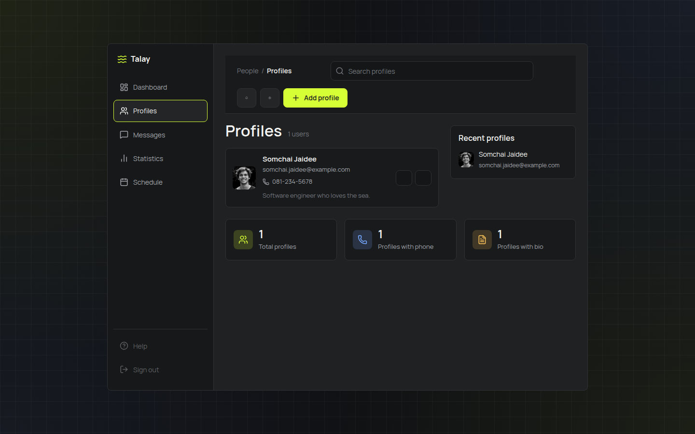
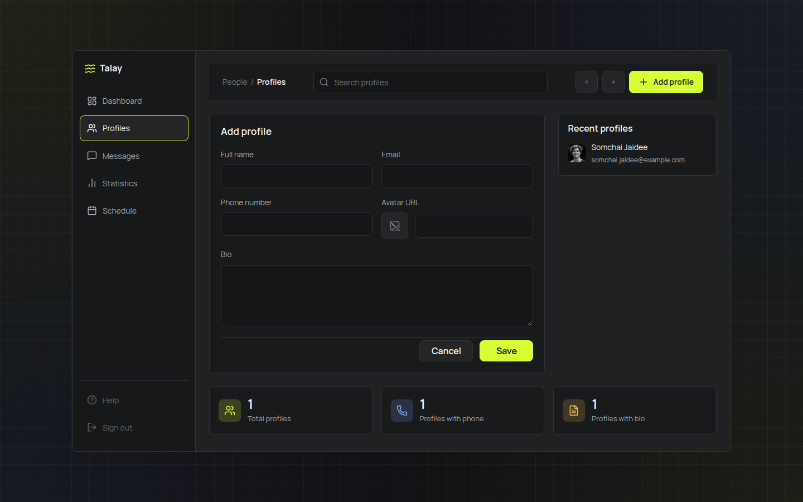
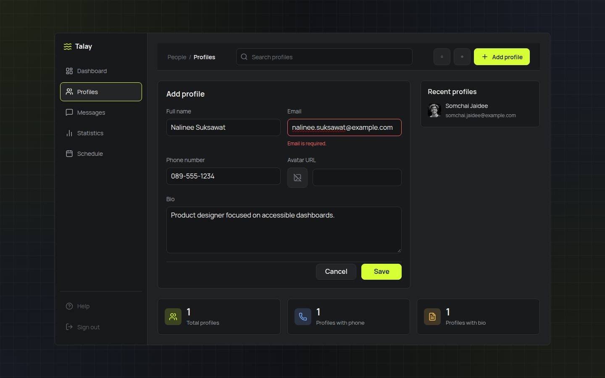
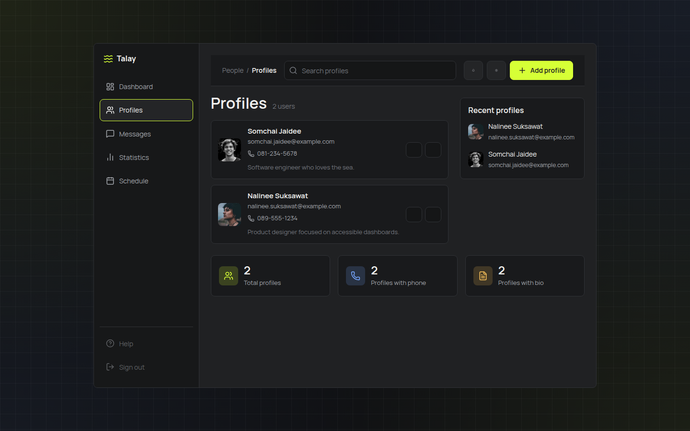
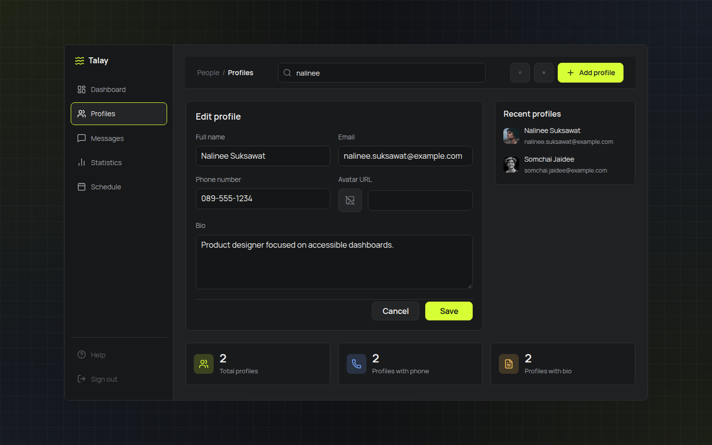
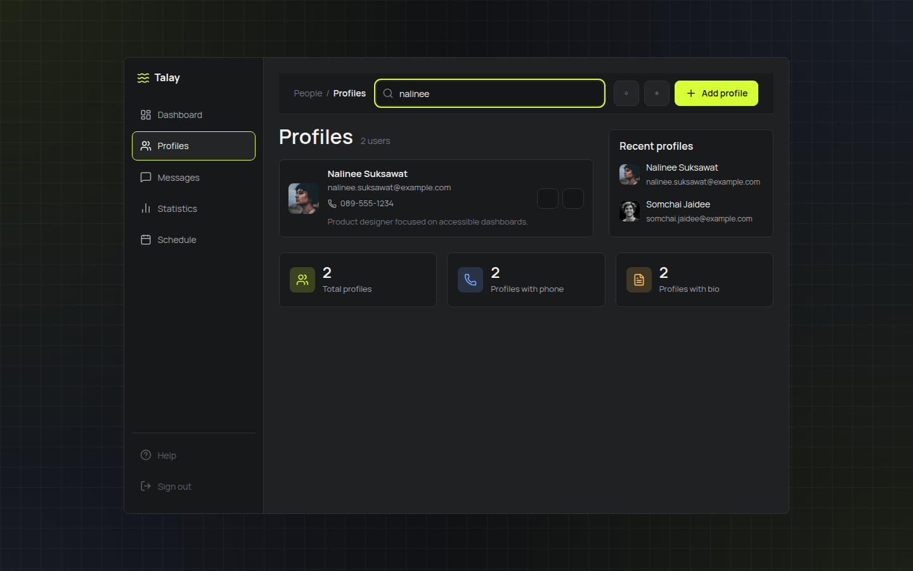
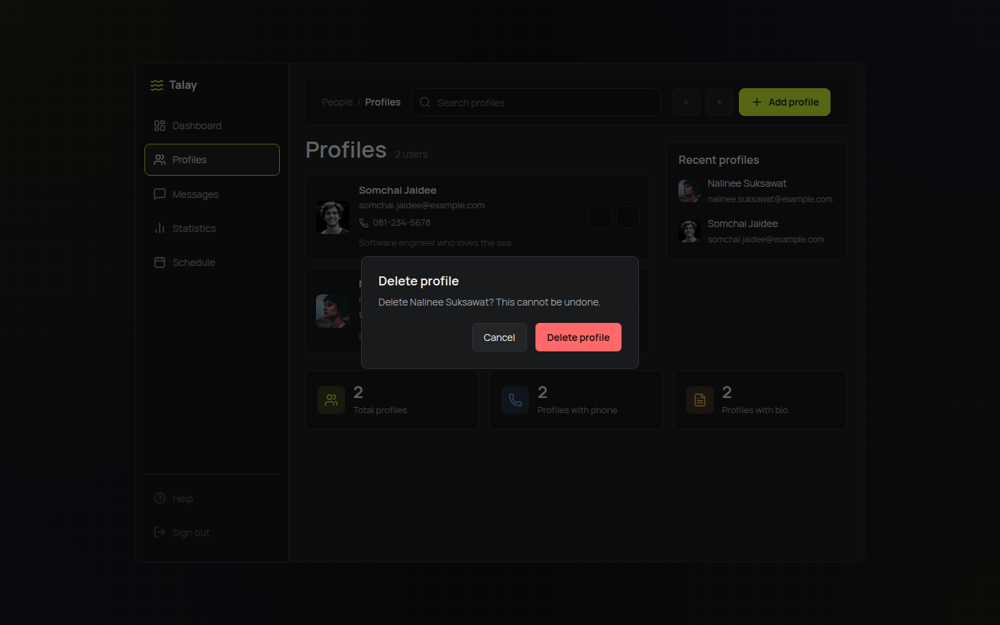

# User Manual — Talay Profile Manager

This manual walks through everyday usage of the Talay dashboard. Screenshots were captured with Playwright MCP against a running instance (frontend on `http://localhost:5173`, API on `http://localhost:5100`) and live in `docs/screenshots/`.

## 1. Dashboard

When you open the app you land on the **Profiles** dashboard: a sidebar for navigation, a top bar with search and an **Add profile** button, the profile list, a **Recent profiles** panel, and summary stat cards (total profiles, profiles with phone, profiles with bio).

## 2. Create a profile

1. Click **Add profile** in the top bar.
2. Fill in the form: **Full name** and **Email** are required; **Phone number**, **Avatar URL**, and **Bio** are optional.

   

3. With values entered, the form looks like this before saving:

   

4. Click **Save**. The new profile appears in the list, the stat cards update, and a success toast is shown.

   

## 3. Edit a profile

Click **Edit** on any profile card. The same form opens, prefilled with that profile's current values — update any field and click **Save** to persist the change, or **Cancel** to discard.

## 4. Search profiles

Type into the **Search profiles** box in the top bar to filter the list by name, email, or phone number (case-insensitive, matches as you type).

## 5. Delete a profile

Click **Delete** on a profile card to open a confirmation dialog. Confirming permanently removes the profile (there is no undo); **Cancel** closes the dialog without changes.

## Notes

- Data is stored in memory on the API — restarting the backend resets profiles back to the single seeded sample.
- See [API-Spec.md](API-Spec.md) for the underlying REST contract and [SDS.md](SDS.md) for the system design.
